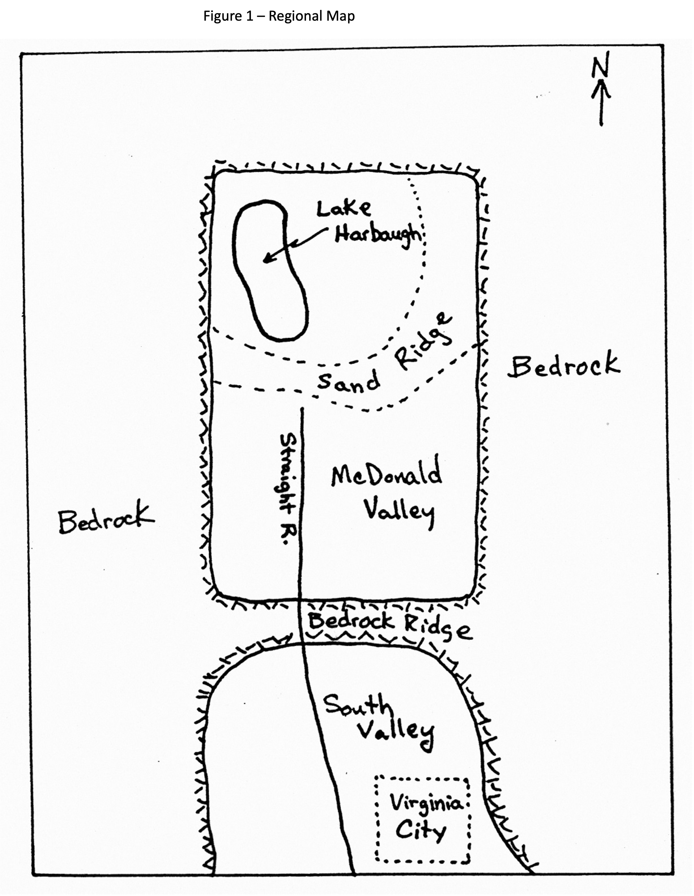
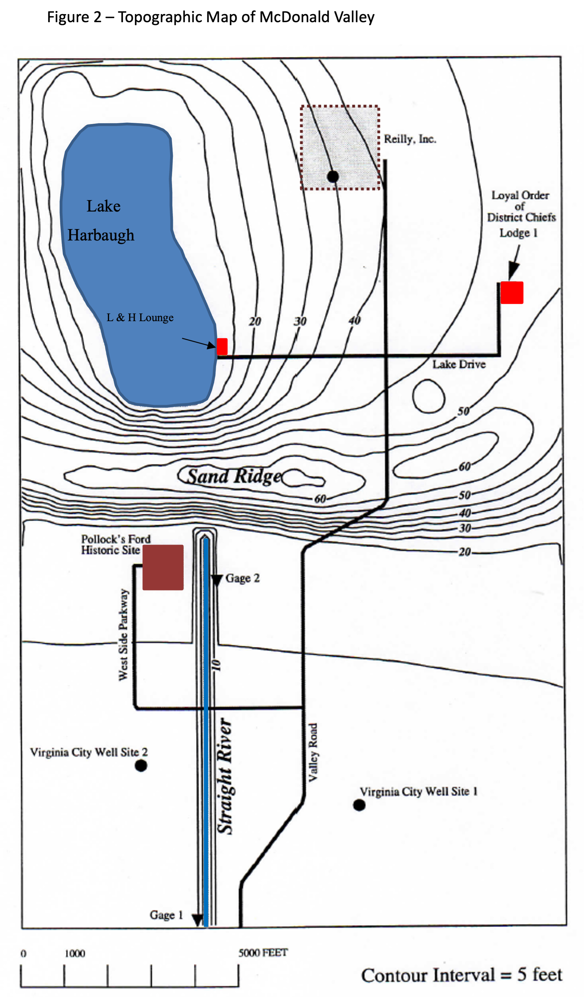

# McDonald Valley Calibration Exercise

## Introduction
In this problem, we have designed a hypothetical field problem. You will get to go through a simulation analysis much as you would in simulating a real field problem. The exercise is intended to give you experience in calibrating a flow model when you have limited information and are forced to make decisions about how to use limited resources to obtain useful new information.

We will approach this problem in four stages:

Stage 1 -- 
Review the existing information and the project objectives to design an effective approach to simulating the system. It is at this stage where you want to consider the pros and cons of various boundary conditions discretization schemes, etc.

Stage 2 -- 
Make a first attempt at developing a calibrated model for the predevelopment condition based on existing data that we will give you.

Stage 3 -- 
Obtain new field information to help you improve your description of the flow system. Use the new information to refine your calibrated predevelopment model. You should use your simulations in stage 2 to guide your data collection activities in stage 3. In real life, you always have limited resources and are forced to make choices about what kind of information is worth obtaining and what is not. We try to create that same type of situation in this problem by setting up a simulated "project" with an initial amount of money that you can use to buy information, such as drilling wells, conducting slug tests, running seismic sections, etc. The budget is tight, so you will be forced to think carefully about what information to buy.

Stage 4 -- 
Simulate the effects of the proposed stresses using the calibrated parameters from stage 3.

## Background Information

McDonald Valley is an undeveloped, closed alluvial valley surrounded by low permeability crystalline bedrock ([figure 1](./figure1.png) and [figure 2](./figure2.png)). The valley is dominated by scenic Lake Harbaugh located in the northwest corner of the valley (lots are available).  Lake Harbaugh sits in a gentle depression that is bounded by Sand Ridge, which extends from the western edge of the valley to the northeastern corner. The south face of Sand Ridge is relatively steep. South of Sand Ridge, the valley slopes gently toward the southern boundary. The Straight River, which has its headwaters at the base of sand ridge just south of Lake Harbaugh, flows south and eventually leaves the valley along the southern boundary. 

You have been given the task of examining the possible effects of groundwater development that has been proposed for McDonald Valley. The following development has been proposed:

  1. A 268,000 ft3/d well in the southern part of the valley at either site 1 or site 2 as shown in [figure 2](./figure2.png). The well would provide a water supply for Virginia City located to the south of McDonald Valley.

  2. A 67,000 ft3/d well is located in the northern part of the valley (site 3 in [figure 2](./figure2.png)). This well would provide natural spring water for Reilly's Premium Beverages, Inc. 

The county is concerned about the effect of this development. Specifically, the county is concerned that:

  1. Development will cause excessive water table declines in the northern half of the valley where a number of summer homes have very shallow water table wells that are used for domestic supply. The county has established the requirement that any development not cause more than a 2 foot decline in the water table anywhere in the northern half of the valley. Consultants for the Reilly Brewing Company contend that pumping from the Reilly well will have a negligible effect on the water table because the well will be placed below a clay layer that occurs across much of the northern part of the valley.

  2. McDonald Valley is the site of the Pollock's Ford National Historic Site and Recreation Area located 1000 feet south of the headwaters of the Straight River. Pollock's Ford is the site of an heroic fording of the Straight River during the battle for Sand Ridge during the American Revolution. Even though easier routes around the north side of the headwaters were discovered within minutes of Pollock's heroic crossing, the event nevertheless remains one of extreme historic importance. The county maintains a stream gage at Pollock's Ford and has decided that any potential development by Virginia City or Reilly's Brewery must not reduce the stream flow at that site by more than 20 percent. In addition, the county is requiring that development not lead to any induced infiltration from the Straight River anywhere along its course.

  3. Water quality issues:

      A. An increase in the number of vacation cabins in the northern part of the valley has lead to concern about the impact of septic systems on Lake Harbaugh. The county is interested in determining the source area for ground water that discharges to Lake Harbaugh so that it can develop effective and rational regulations for septic system permits. 

      B. Reilly's was required to do a capture zone analysis to determine the source area for its deep well. The company's consultants did a model of the Reilly site and concluded that the source area is contained entirely within the Reilly property. The county suspects that that analysis is not correct because the boundaries of the model extended only to the property lines of  the Reilly facility. A flow model of the entire valley would provide a better basis for evaluating the source area for the well.

      C. The county is requiring capture zone analyses for the proposed Virginia City wells.

## Hydrogeology

The valley contains unconsolidated valley fill alluvium. No hydraulic tests have been performed in the valley, but the sediments are similar to those in other valleys in the area which generally have horizontal hydraulic conductivities ranging between 10 feet/day and 500 feet/day. The sediments are predominantly medium to coarse grained sands and some gravels, however a low permeability lake clay has been observed in some bore holes in the valley. The valley contains 17 existing observations wells. Well logs for those 17 wells are presented in Table 1. The crystalline bedrock surrounding the valley has a very low hydraulic conductivity.

## Hydrology

The hydrologic system in McDonald Valley is in steady state with no significant seasonal or short term fluctuations in conditions.

McDonald Valley has a mean annual precipitation of 36 inches per year based on measurements made at Lake Harbaugh. Other stations in the area also report annual precipitation of 36 inches per year. 

There is no surface water inflow into the valley. The Straight River originates in McDonald Valley. The headwaters of the river is located 9000 feet upstream from the southern boundary of the valley. The river stage at the southern boundary of the valley is defined to be 0, the datum to which all other head measurements in the valley are referenced. The stream gradient is 0.0002, which corresponds to a stage of 1.8 feet at the headwaters. The river is approximately 100 feet wide over its entire length and has a depth of 1 foot or less in most locations. Stream gages are located at the river's southern discharge point and at Pollock's Ford.

| Measured Stream Flow (ft3/d)    | Location |
| -------- | ------- |
|  884,494  | Southern Boundary (gage 1) |
| 96,402 | Pollock's Ford (gage 2) |

Lake Harbaugh is a dominant hydrologic feature in the valley. A previous study of Lake Harbaugh yielded the following information:
* Stage = 11 feet
* Area of the lake = 1.625 x 10**7 square feet
* Lake Evaporation = 27 inches per year (2.25 ft/y)
* Precipitation = 36 inches per year (3 ft/y)

Lake Harbaugh is a closed lake with no surface water inflow or outflow. The morphology of the lake basin consists of a relatively steep sloping shore that levels out to a very uniform depth of 16 feet within 50 feet of the lake shore. The lake bottom is sandy and free of fine grained sediments over most of its bottom, especially near the shore. Very minor amounts of fine grained sediments occur in the very center of the lake basin.

## Data for Existing Wells

Data for the existing well is located in [Table 1](./table1.md).
