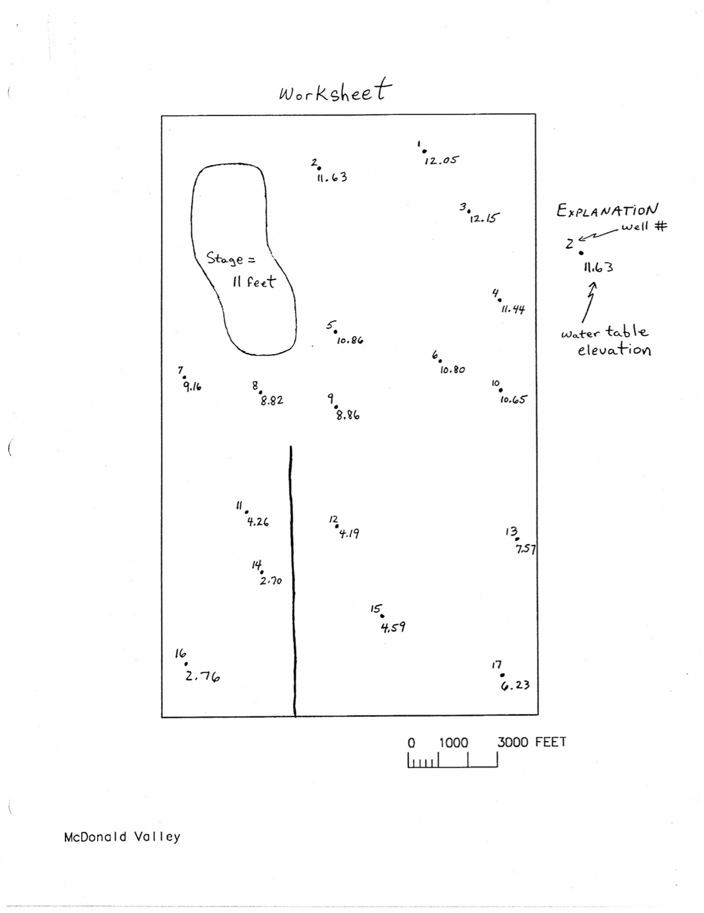
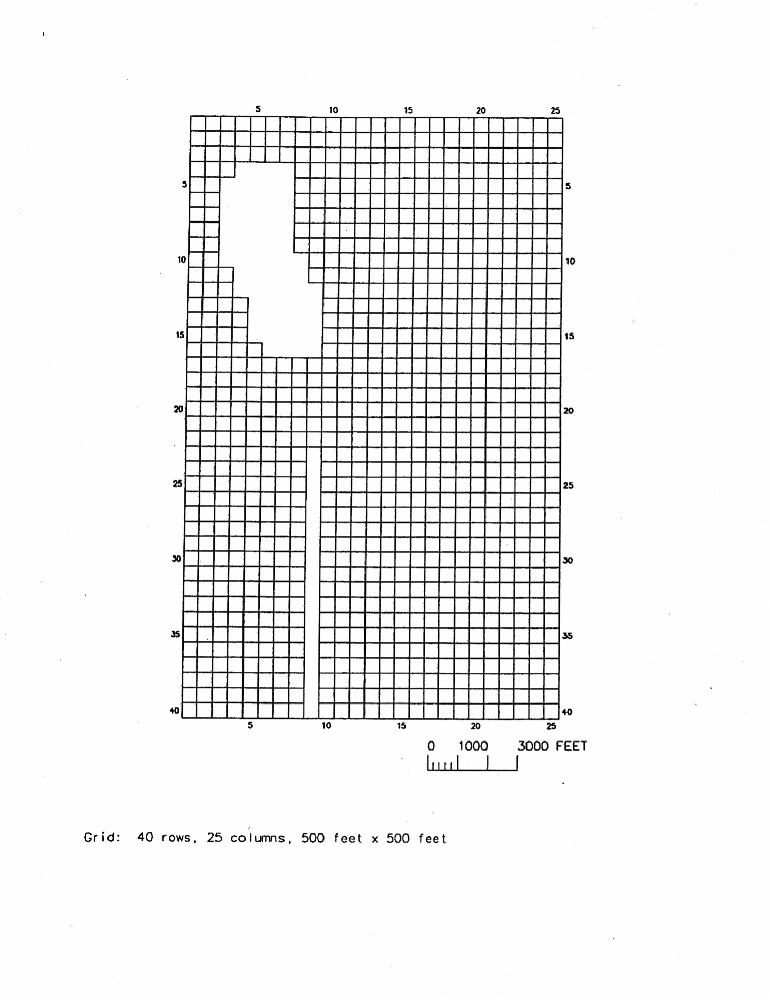

# McDonald Valley Calibration Exercise

## Stage 1 -- Problem Formulation and Analysis of Existing Data
Stage 1 is the planning phase of the study. Based on the information you have been given, develop a conceptual model of the flow system. What things are important with respect to the objectives of your study? After you have a conceptual model formulated, you need to translate that into discretized form so that you can use MODFLOW to simulate the system. We have included some questions that you should consider as you plan your strategy.

To simplify things for the purposes of this class problem, we will all use the same areal grid which has 40 rows and 25 columns. The grid cells are constant 500 foot by 500 foot squares over the entire area. Copies of the grid are attached to this hand out. You have some freedom to discretize the problem in the vertical direction. However, you should try to use no more than 4 layers to simulate this problem. Remember, the more layers you have, the more data you will have to manage when you run your simulations. 

## Study Questions

1.  Sketch a contour map of the water table on the worksheet we have provided ([figure 3](./figure3.png)).

2.  Describe the elements of the hydrogeology of this system that you believe will be most important in your analysis.

3.  Describe how you would treat the boundary conditions and stresses.

4.  On the grid worksheet ([figure 4](./figure4.png)), label the cells that would be used to simulate the lake and river. How will you incorporate the effects of the lake and river into those cells.

5.  Describe how you would discretize the system in the vertical dimension.

6.  On one of your maps, mark the portion of the lake shore where groundwater discharges to the lake. Do the same for the portion of the lake shore where flow is from the lake to the ground water system.

7.  Write a water budget equation for the lake. Is the lake a net source or sink of water for the ground water system?  Can you make a quantitative estimate of the net rate of ground water recharge or discharge due to the lake?      

8.  What is the total recharge to McDonald Valley and how is it distributed?

